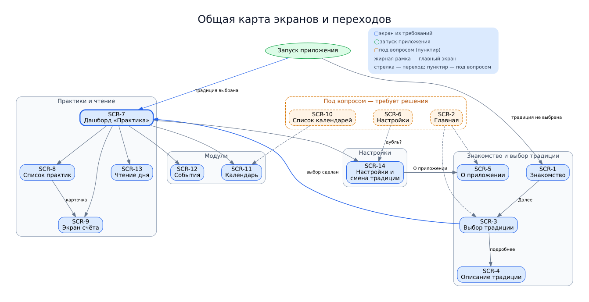
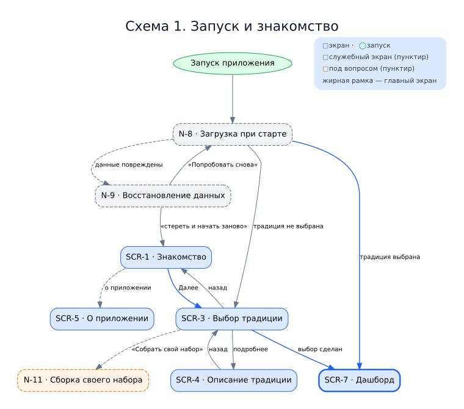
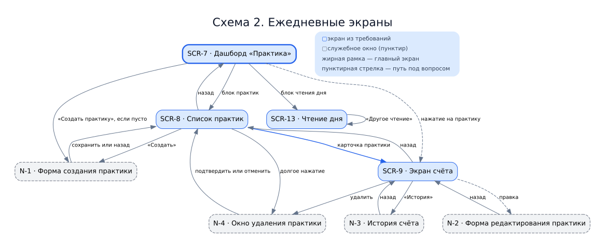
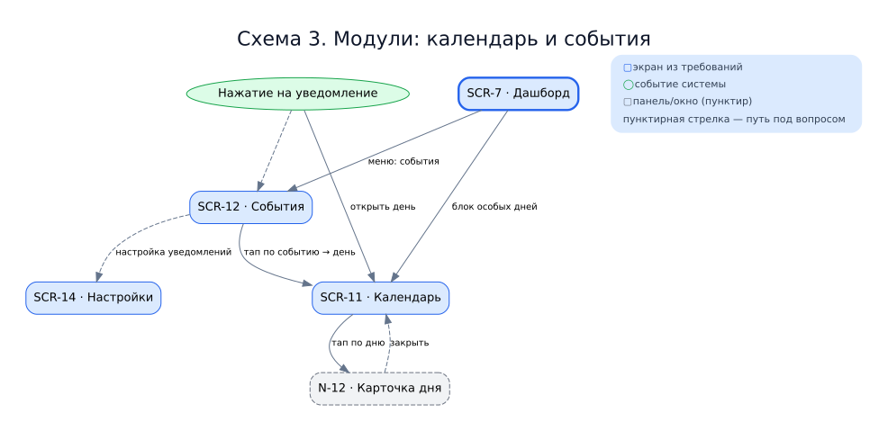
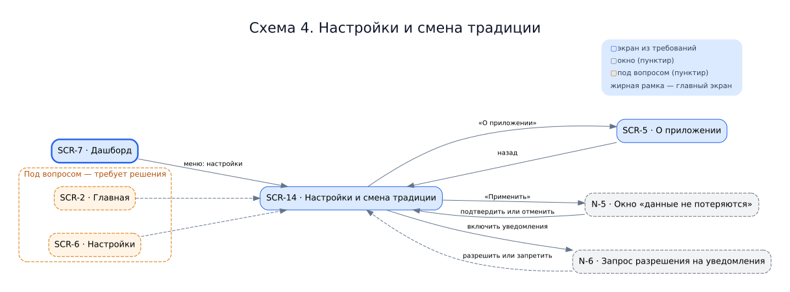
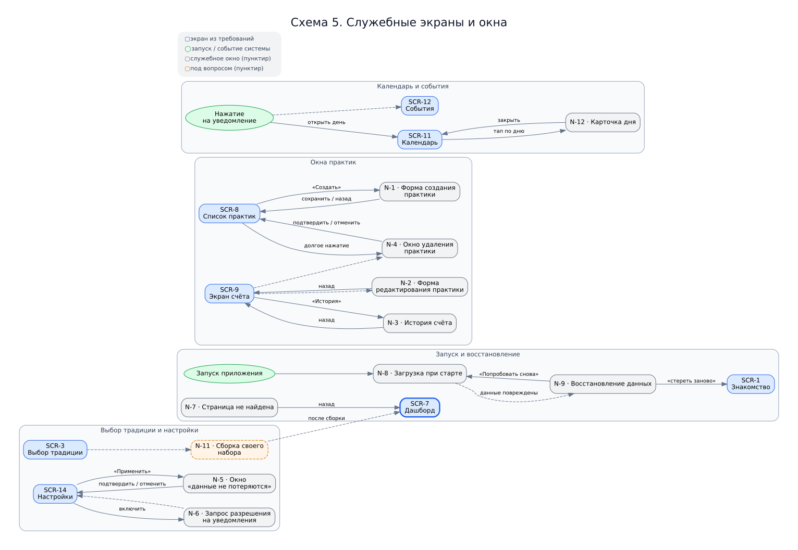

# Карта экранов и переходов («технический путь пользователя», Этап 8)

> _Статус: черновик · владелец: пользователь/Антоха · состояние: **целевое** (что хотим построить на Этапе 8), а не описание текущего кода._

**Зачем этот документ.** Показать дизайнеру устройство страниц и все пути между ними,
а Антохе — перечень мест, где путь ещё не решён (он сейчас переосмысляет сценарий, поэтому
неясности здесь собраны отдельным списком, а не решены за него).

**На чём основан.** Раздел 9 требований ([BFT-v1.15.md](BFT-v1.15.md)) — реестр экранов
`SCR-1…SCR-14`. Плюс экраны и окна, которых в требованиях нет, но без них приложение
не соберётся (форма создания практики, окна подтверждений, экран ошибки и т. п.).

## Как читать документ

- **Экран** — целая страница приложения. Номера `SCR-N` взяты из требований, номера
  `N-N` — служебные (их в требованиях нет).
- **Переход** — возможность попасть с одного экрана на другой: нажатие кнопки, тап по
  блоку, системное событие (например, нажатие на уведомление).
- **Состояние** — как выглядит экран при разных обстоятельствах: *есть данные*, *пусто*,
  *идёт загрузка*, *ошибка*. Дизайнеру нужны все четыре, а не только «есть данные».
- **❓ Открытое место** — путь или смысл, который пока не решён. Решает Антоха (сценарий)
  или пользователь (продукт). Это не ошибки, а честно помеченные вопросы.

**Рамки MVP.** Для первой версии работают две традиции — Ньингма и Тхеравада
(решение D-23). Всё, что требует «нескольких традиций сразу» или «нескольких календарей
одновременно», по умолчанию отложено на потом.

**Что уже есть в коде.** Сейчас реализованы только: выбор традиции, список практик,
форма создания практики, экран счёта. Остальные экраны из этого документа существуют
пока лишь как замысел. Это нормально: документ описывает цель Этапа 8.

---

## 1. Общая схема

Основные пути — на картинке ниже. Стрелка означает «можно перейти и по какому
действию»; пунктир — путь под вопросом. Подробные списки переходов — в карточках
экранов (разделы 2–6).

Синий — экран из требований, оранжевый — под вопросом. Исходники всех схем лежат в
`docs/diagrams/` (файлы `.dot`); рядом с каждым — готовые `.svg` и `.png` для дизайнера.
Ниже по разделам — те же пути крупнее, по частям.

Спорные экраны (нужны ли они — см. раздел 5) на схеме намеренно не показаны:
`SCR-2 · Главная`, `SCR-6 · Настройки`, `SCR-10 · Список календарей`.

---

## 2. Знакомство и выбор традиции

### SCR-1 · Знакомство (онбординг)
- **Зачем:** первый запуск. Коротко объяснить, что это за приложение и что внутри.
- **Что на экране:** текст-описание приложения; карточки о возможностях (можно
  перелистывать); кнопка продолжить.
- **Откуда сюда попадают:** первый запуск, когда традиция ещё не выбрана; «начать заново»
  с экрана восстановления данных.
- **Куда можно уйти:** «Далее» → Выбор традиции (SCR-3); «посмотреть о приложении» →
  О приложении (SCR-5).
- **Состояния:** статичный текст; загрузка данных о традициях; ошибка загрузки.
- **❓ Открытое место:** чем «Пропустить» отличается от «Далее»? Если традицию выбрать
  обязательно, то куда ведёт пропуск?

### SCR-3 · Выбор традиции
- **Зачем:** человек выбирает традицию, с которой будет работать. От неё зависят
  календарь, список практик и тексты.
- **Что на экране:** заголовок шага; карточки традиций/пресетов с кратким описанием;
  кнопки «Назад» и «Пропустить»; «Собрать свой набор»; полоска прогресса.
- **Откуда сюда попадают:** из знакомства; при запуске без выбранной традиции; «начать
  заново» с экрана восстановления.
- **Куда можно уйти:** после выбора «Продолжить» → Дашборд (SCR-7); «подробнее» →
  Описание традиции (SCR-4); «Назад» → Знакомство (SCR-1); «Собрать свой набор» → экран
  сборки (N-11, его пока нет).
- **Состояния:** идёт загрузка пресетов; пусто (пресетов нет — остаётся только «собрать
  свой набор»); ошибка загрузки.
- **❓ Открытое место:** в требованиях перечислены четыре школы, а в MVP работают две
  (Ньингма, Тхеравада). Сколько показывать? Что такое «свой набор» — отдельный экран,
  и входит ли он в MVP?

### SCR-4 · Описание традиции
- **Зачем:** подробнее рассказать о традициях, чем помещается в карточке.
- **Что на экране:** прокручиваемый текст: названия традиций и краткое описание.
- **Откуда сюда попадают:** из выбора традиции, по «подробнее».
- **Куда можно уйти:** «назад» → Выбор традиции (SCR-3).
- **Состояния:** статичный текст.
- **❓ Открытое место:** это отдельный экран или раскрывающаяся карточка прямо в выборе
  традиции?

### SCR-5 · О приложении
- **Зачем:** напомнить о приложении тем, кто пропустил знакомство.
- **Что на экране:** тот же текст и те же карточки, что в знакомстве, но без шагов.
- **Откуда сюда попадают:** из настроек; из меню дашборда; из знакомства.
- **Куда можно уйти:** «назад».
- **Состояния:** статичный текст.
- **❓ Открытое место:** сознательно дублирует знакомство? Как сделать так, чтобы тексты
  двух экранов не разошлись (один источник текста на оба)?

---

## 3. Ежедневные экраны

### SCR-7 · Дашборд («Практика»)
- **Зачем:** то, что человек видит, когда хочет заняться сегодня. Короткая сводка дня.
- **Что на экране:** особые дни сегодня; счётчики практик; текст дня; переходы в разделы.
  Если практик ещё нет — кнопка «Создать практику».
- **Откуда сюда попадают:** запуск приложения (традиция уже выбрана); из меню; после
  выбора традиции.
- **Куда можно уйти:** блок практик → Список практик (SCR-8); нажатие на практику →
  Экран счёта (SCR-9); «Создать практику» → Форма создания (N-1); блок чтения дня →
  Чтение дня (SCR-13); блок особых дней → Календарь (SCR-11); меню «события» → События
  (SCR-12); меню «настройки» → Настройки (SCR-14); меню «о приложении» → SCR-5.
- **Состояния:** есть данные; пусто (практик нет); идёт загрузка; ошибка.
- **❓ Открытое место:** этот экран и «Главная» (SCR-2) частично про одно и то же. Нужен
  ли отдельный «Главная»? Куда должно вести нажатие на саму практику — в список или сразу
  в счёт?

### SCR-8 · Список практик
- **Зачем:** посмотреть все практики и управлять ими.
- **Что на экране:** карточки практик (название, счёт, цель, полоска прогресса); фильтр
  по традиции; кнопка «Создать».
- **Откуда сюда попадают:** с дашборда, из блока практик.
- **Куда можно уйти:** карточка практики → Экран счёта (SCR-9); «Создать» → Форма
  создания (N-1); долгое нажатие → Окно удаления (N-4); «назад» → Дашборд (SCR-7).
- **Состояния:** есть данные; пусто (с пояснением и кнопкой «Создать»); идёт загрузка.
- **❓ Открытое место:** нужен ли фильтр по традиции в MVP, если активная традиция одна?

### SCR-9 · Экран счёта
- **Зачем:** отмечать выполнение практики — главное действие приложения.
- **Что на экране:** большая кнопка «+»; текущий счёт; цель; прогресс (не больше 100%);
  кнопка «История».
- **Откуда сюда попадают:** из списка практик; с дашборда (нажатие на практику).
- **Куда можно уйти:** «История» → История счёта (N-3); «удалить» → Окно удаления (N-4);
  «назад» → Список практик (SCR-8).
- **Состояния:** есть данные; история пуста; цель достигнута (100%).
- **❓ Открытое место:** где живёт удаление практики — только здесь, только в списке или
  в обоих местах? (В требованиях — по долгому нажатию, но не сказано, на каком экране.)

### SCR-13 · Чтение дня
- **Зачем:** ежедневный текст для чтения, без отвлечений.
- **Что на экране:** блок текста; источник/перевод; кнопка «Другое чтение».
- **Откуда сюда попадают:** с дашборда, из блока чтения дня; из ленты событий (возможно).
- **Куда можно уйти:** «Другое чтение» меняет текст на месте; «назад» → Дашборд (SCR-7).
- **Состояния:** есть текст; фолбэк, если готового текста нет (приложение показывает
  собственные краткие формулировки).
- **❓ Открытое место:** есть ли у текста отдельный экран-настройка (например, «читать
  позже»), или всё живёт на одном экране?

---

## 4. Модули

### SCR-11 · Календарь
- **Зачем:** показать особые дни традиции.
- **Что на экране:** сетка месяца (или года); подсветка 10-го и 25-го дней, упосатх,
  праздников; карточка дня («проверено» / «не проверено»); легенда. Переключатель
  активных календарей — под вопросом (см. ниже).
- **Откуда сюда попадают:** с дашборда, из блока особых дней; из ленты событий; из
  нажатия на уведомление; из меню.
- **Куда можно уйти:** тап по дню → Карточка дня (N-12, панель поверх календаря);
  «назад».
- **Состояния:** идёт расчёт; «дата пока не проверена»; для традиции нет календаря.
- **❓ Открытое место:** переключатель активных календарей требует нескольких календарей
  сразу — а в MVP календарь один. Оставляем переключатель в MVP или откладываем?

### SCR-12 · События
- **Зачем:** лента праздников традиции.
- **Что на экране:** список «сегодня / предстоящие»; дата и тип праздника;
  переключатель традиции; настройка уведомлений.
- **Откуда сюда попадают:** из меню; с дашборда; из нажатия на уведомление.
- **Куда можно уйти:** тап по событию → Календарь (SCR-11) на нужном дне; «настройка
  уведомлений» → Настройки (SCR-14); «назад».
- **Состояния:** пусто (нет набора событий); уведомления выключены.
- **❓ Открытое место:** настройка уведомлений есть и здесь, и в настройках. Где она
  должна жить — в одном месте или в двух?

### N-12 · Карточка дня (панель)
- **Зачем:** показать подробности выбранного дня, не уходя с календаря.
- **Что на экране:** дата; тип особого дня; пометка «проверено / не проверено».
- **Открывается:** тапом по дню в календаре (SCR-11).
- **Закрывается:** свайпом или нажатием «закрыть», остаёшься в календаре.

---

## 5. Настройки

### SCR-14 · Настройки и смена традиции
- **Зачем:** управлять традицией и уведомлениями.
- **Что на экране:** список традиций/пресетов; кнопка «Применить»; переключатели
  уведомлений (включение и время); тема (светлая/тёмная/системная); «О приложении».
- **Откуда сюда попадают:** из меню; с экрана событий (настройка уведомлений); с
  дашборда.
- **Куда можно уйти:** «Применить» → Окно «данные не потеряются» (N-5); включение
  уведомлений → Запрос разрешения (N-6); «О приложении» → SCR-5; «назад».
- **Состояния:** смена активной традиции; пусто (пресетов нет); уведомления выключены.
- **❓ Открытое место:** в требованиях есть и отдельный экран «Настройки» (SCR-6). Это
  один экран или два? Где живут уведомления — здесь, в событиях или в обоих местах?
  Нужна ли смена темы в MVP?

---

## 6. Спорные экраны (нужны ли они)

Эти экраны есть в требованиях, но плохо стыкуются с остальной картиной. Решение — за
Антохой/пользователем.

### SCR-2 · Главная
- **Что описано:** «познакомиться с приложением и настроить под себя»: выбор традиции,
  описание традиции, о приложении, настройки, уведомления.
- **Проблема:** всё это уже есть на других экранах, а живых данных здесь нет. Получается
  второе «домашнее» рядом с дашбордом.
- **Варианты:** убрать совсем (ссылки живут в меню дашборда) **или** оставить как меню —
  но тогда переименовать в «Ещё».
- **❓ Решить:** нужна ли отдельная «Главная»? Если да — это меню или полноценный экран?

### SCR-6 · Настройки
- **Что описано:** «тема, уведомления».
- **Проблема:** почти совпадает с SCR-14, а уведомления оказались бы в двух экранах.
- **Варианты:** слить с SCR-14 в один экран секциями **или** оставить два, но чётко
  разделить: здесь — тема и уведомления, там — традиция.
- **❓ Решить:** один экран настроек или два? Уведомления — в одном месте или в двух?

### SCR-10 · Список календарей
- **Что описано:** управление несколькими календарями (названия, стиль оформления).
- **Проблема:** в MVP календарь один, он выбирается вместе с традицией. Нескольких
  календарей одновременно не будет (отложено на версию 1.1).
- **Варианты:** убрать из MVP **или** оставить как «выбор оформления календаря».
- **❓ Решить:** нужен ли этот экран в первой версии?

---

## 7. Служебные экраны и окна (в требованиях их нет)

Без них приложение не соберётся, поэтому они тоже часть карты.

| Номер | Экран / окно | Зачем | Откуда | Куда |
|-------|--------------|-------|--------|------|
| N-1 | Форма создания практики | создать новую практику | дашборд, список практик | сохранить → список практик (SCR-8) |
| N-2 | Форма редактирования практики | поправить счёт/название (правка счёта пока в бэклоге) | экран счёта | назад |
| N-3 | История счёта | посмотреть отметки практики | экран счёта (SCR-9) | назад → экран счёта |
| N-4 | Окно удаления практики | подтвердить удаление | долгое нажатие в списке или счёте | подтвердить/отменить → назад |
| N-5 | Окно «данные не потеряются» | успокоить при смене традиции | настройки (SCR-14) | подтвердить/отменить → настройки |
| N-6 | Запрос разрешения на уведомления | системный запрос при включении | настройки, события | разрешить/запретить → назад |
| N-7 | Страница не найдена | вместо падения при плохой ссылке | любой неверный адрес | «назад» → дашборд |
| N-8 | Загрузка при старте | показать, что приложение запускается | запуск приложения | дальше по состоянию данных |
| N-9 | Восстановление данных | если сохранённые данные повреждены | запуск приложения | «Попробовать снова» или «стереть и заново» |
| N-10 | Нажатие на уведомление | открыть приложение на нужном дне | системное уведомление | календарь или события |
| N-11 | Сборка своего набора | собрать свою традицию из частей | выбор традиции | пока экрана нет — только замысел |
| N-12 | Карточка дня | подробности дня в календаре | календарь | закрыть → календарь |

**Известная проблема (N-9).** На экране восстановления кнопка «Попробовать снова» сейчас
не показывает, что попытка не удалась. Это открытый баг B-25 (см. [../STATE.md](../STATE.md)),
дизайнеру стоит знать: у этого состояния нужен честный вид «не получилось».

---

## 8. Открытые места — сводный список для Антохи

Ниже всё, что требует решения по сценарию. Каждый пункт — с вопросом и тем, кто решает.

| № | Вопрос | Кто решает |
|---|--------|------------|
| 1 | «Главная» (SCR-2) и «Дашборд» (SCR-7) — одна точка входа или две? | Антоха |
| 2 | Настройки: один экран или два (SCR-6 и SCR-14)? Где живут уведомления? | Антоха |
| 3 | «Знакомство» (SCR-1) и «О приложении» (SCR-5) повторяют друг друга — так задумано? | Антоха |
| 4 | «Описание традиции» (SCR-4) — отдельный экран или раскрытие карточки в выборе? | Антоха |
| 5 | «Список календарей» (SCR-10) и переключатель календарей — под MVP календарь один; нужны ли? | Антоха |
| 6 | Сколько традиций показывать при выборе: в тексте четыре, в MVP работают две | Антоха |
| 7 | «Уведомления» в главной — куда они ведут? | Антоха |
| 8 | Чем «Пропустить» отличается от «Далее» в знакомстве? | Антоха |
| 9 | Нажатие на практику: в список или сразу в счёт? | пользователь/Антоха |
| 10 | «Свой набор» традиции — отдельный экран и входит ли в MVP? | Антоха |
| 11 | Экран восстановления данных (N-9) — какой у него честный вид при неудаче? | дизайн + пользователь |
| 12 | Нажатие на уведомление: куда именно открывать — календарь или события? | Антоха |

Родственные вопросы уже ведутся в реестре открытых вопросов ([OPEN-QUESTIONS.md](OPEN-QUESTIONS.md)).

---

## 9. Что дальше

1. Антоха проходит раздел 8 и оставляет решения (можно прямо в этом файле, отдельной
   пометкой под карточкой или в таблице).
2. Открытые места переезжают в [OPEN-QUESTIONS.md](OPEN-QUESTIONS.md) — чтобы у каждого
   был владелец.
3. После решений схема и карточки приводятся к выбранному сценарию, и документ
   становится основой для мокапов дизайнера.
